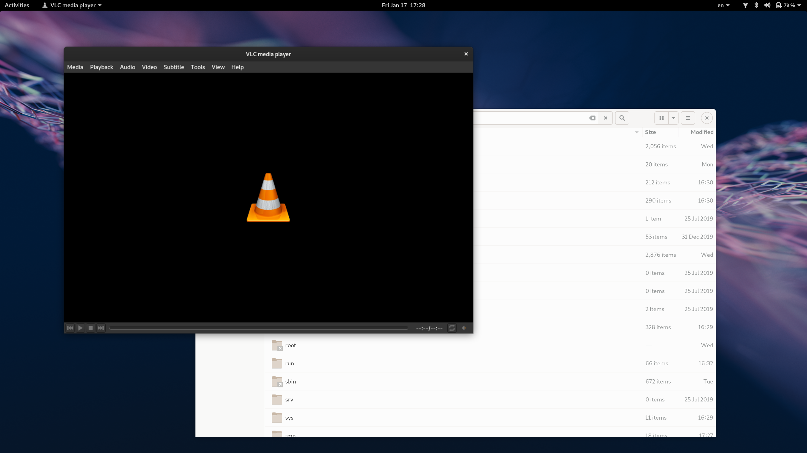

# VLC GTK Theme Variant Plugin

A VLC interface plugin that allows you to start VLC in your GTK theme's dark
mode.

I'm running Gnome with the stock Adwaita (light) theme. I've configured
VLC to run in Adwaita Dark mode.

## Installation

- Download `gtk-interface-variant.lua` to `~/.local/share/vlc/lua/intf/gtk-interface-variant.lua`
- Start VLC with `vlc --extraintf luaintf --lua-intf gtk-interface-variant "$@"`

There's probably a way to configure VLC to start with the extra interface
without having to pass in these args but I haven't bothered to invest any
time into figuring this out.

I've gone the lazy route and created my own ~/bin/vlc wrapper with an
accompanying /.local/share/applications/vlc.desktop file.

Within VLC, you can then configure the window style to use your desired QT
theme. In my case, `Adwaita-Dark`:

Tools > Preferences > Interface > Force Window Style

